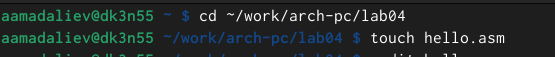
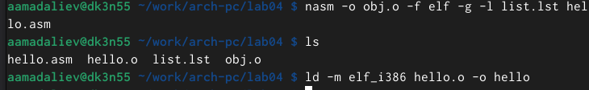
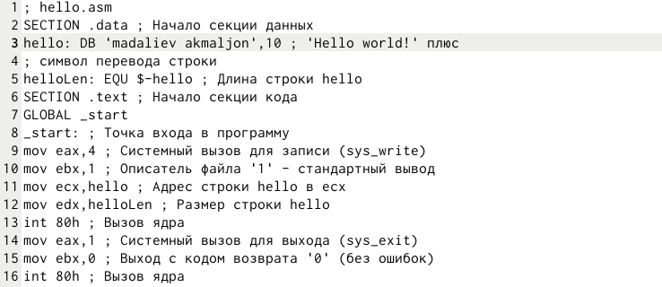
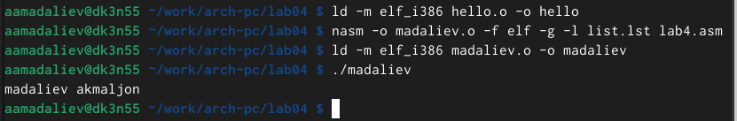
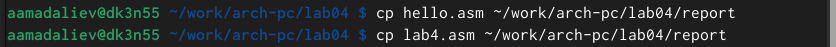
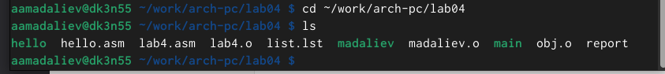

---
## Front matter
title: "Отчёт по лабораторной работе №4"
subtitle: "Язык ассемблера NASM"
author: "Мадалиев А.А"

## Generic otions
lang: ru-RU
toc-title: "Содержание"

## Bibliography
bibliography: bib/cite.bib
csl: pandoc/csl/gost-r-7-0-5-2008-numeric.csl

## Pdf output format
toc: true # Table of contents
toc-depth: 2
lof: true # List of figures
lot: true # List of tables
fontsize: 12pt
linestretch: 1.5
papersize: a4
documentclass: scrreprt
## I18n polyglossia
polyglossia-lang:
  name: russian
  options:
	- spelling=modern
	- babelshorthands=true
polyglossia-otherlangs:
  name: english
## I18n babel
babel-lang: russian
babel-otherlangs: english
## Fonts
mainfont: IBM Plex Serif
romanfont: IBM Plex Serif
sansfont: IBM Plex Sans
monofont: IBM Plex Mono
mathfont: STIX Two Math
mainfontoptions: Ligatures=Common,Ligatures=TeX,Scale=0.94
romanfontoptions: Ligatures=Common,Ligatures=TeX,Scale=0.94
sansfontoptions: Ligatures=Common,Ligatures=TeX,Scale=MatchLowercase,Scale=0.94
monofontoptions: Scale=MatchLowercase,Scale=0.94,FakeStretch=0.9
mathfontoptions:
## Biblatex
biblatex: true
biblio-style: "gost-numeric"
biblatexoptions:
  - parentracker=true
  - backend=biber
  - hyperref=auto
  - language=auto
  - autolang=other*
  - citestyle=gost-numeric
## Pandoc-crossref LaTeX customization
figureTitle: "Рис."
tableTitle: "Таблица"
listingTitle: "Листинг"
lofTitle: "Список иллюстраций"
lotTitle: "Список таблиц"
lolTitle: "Листинги"
## Misc options
indent: true
header-includes:
  - \usepackage{indentfirst}
  - \usepackage{float} # keep figures where there are in the text
  - \floatplacement{figure}{H} # keep figures where there are in the text
---

# Цель работы

Освоение процедуры комбиляции и сборки программ, написанных на ассемблере NASM.

# Задание

1. ПрограммаHelloworld!
1.1 создать каталог для работы с программами на языке ассемблера NASM 1.2 перейти в созданный каталог
1.3 создать текстовый файл с именем hello.asm
1.4 открыть этот файл
1.5 ввести в него указанный текст
2. ТрансляторNasm
2.1 выполнить комппиляцию в объектный код
3. Расширенныйсинтаксис
3.1 выполнить компиляцию исходного файла
4. КомпановщикLD
4.1 передать объектный файл на обработку компановщику
5. Запуститьисполняемыйфайл
6. Заданиядлясамостоятельнойработы
6.1 создать копию файла hello.asm с именем lab4.asm
6.2 изменить скопированный файл, чтобы выводилась строка с именем и фамилией
6.3 оттранслировать полученный текст программы lab4.asm в объектный файл
6.4 скопировать файлы hello.asm и lab4.asm в локальный репозиторий

# Теоретическое введение

В процессе создания ассемблерной программы можно выделить четыре шага: • Набор текста программы в текстовом редакторе и сохранение её в отдельном файле. Каждый файл имеет свой тип (или расширение), который определяет назначение файла. Файлы с исходным текстом программ на языке ассемблера имеют тип asm.
• Трансляция — преобразование с помощью транслятора, например nasm, текста программы в машинный код, называемый объектным. На данном этапе также может быть получен листинг программы, содержащий кроме текста программы различную дополнительную информацию, созданную транслятором. Тип объ- ектного файла — o, файла листинга — lst.
• Компоновка или линковка — этап обработки объектного кода компоновщиком (ld), который принимает на вход объектные файлы и собирает по ним исполняе- мый файл. Исполняемый файл обычно не имеет расширения. Кроме того, можно получить файл карты загрузки программы в ОЗУ, имеющий расширение map.
• Запуск программы. Конечной целью является работоспособный исполняемый файл.
Ошибки на предыдущих этапах могут привести к некорректной работе програм- мы, поэтому может присутствовать этап отладки программы при помощи специ- альной программы — отладчика. При нахождении ошибки необходимо провести коррекцию программы, начиная с первого шага.

# Выполнение лабораторной работы
1. Переходим в каталог lab04 и создаем текстовый файл hello.asm

{#fig:001 width=70%}    
Создание файла hello.asm (рис 1)
2. Открываем этот файл в gedit и вводим текст.

{#fig:001 width=70%}    
Открытие файла (рис 2)
3. Компилируем написанный текст с помощью следующей команды.

{#fig:001 width=70%}    
Компиляция текста (рис 3)
4. Компилируем файл hello.asm в obj.o и проверяем с помощью команды ls

{#fig:001 width=70%}    
Компиляция файла (рис 4)
5. Передаем объектный файл на обработку компоновщику для получения исполняемой программы.

{#fig:001 width=70%}    
Обработка файла (рис 5)
6. Вносим изменения в тексте программы в файле lab4.asm

{#fig:001 width=70%}    
Обаботка файла (рис 6)
7. Транслируем полученный текст программы lab4.asm в объектный файл.
Выполняем компоновку данного файла и запускаем получившийся файл.

{#fig:001 width=70%}    
Команда main (рис 7)
8. Копируем файлы hello.asm, lab4.asm в локальный репозиторий в каталог
~/work/study/2024-2025/"Архитектура компьютера"/arch-pc/labs/labs04 с помощью утилиты cp и проверяем наличие файлов с помощью утилиты ls.

{#fig:001 width=70%}    
{#fig:001 width=70%}    
Запуск файла

# Выводы

В ходе выполнения работы я освоил процедуры компиляции и сборки программ, написанных на ассемблере NASM.

# Список литературы{.unnumbered}

::: {#refs}
:::
